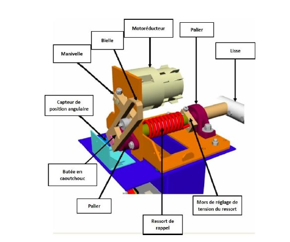
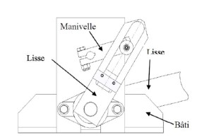
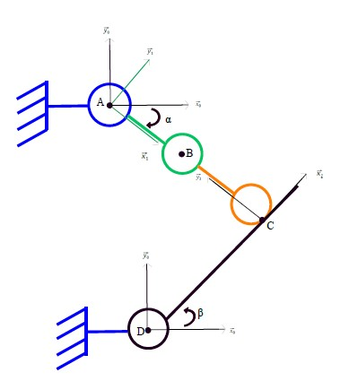
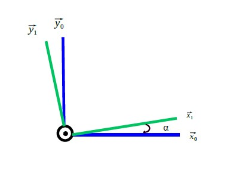
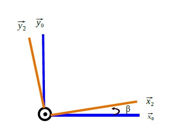
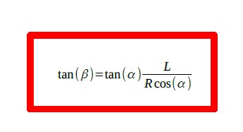

<html>
 <head>
    <meta charset="utf-8"/>
    <link href="style.css" rel="stylesheet" type="text/css"/>
 </head>
 <body>
  <h1 id="h1" style="border: 1px solid red; padding: 10px;"><b>BARRIÈRE SYMPACT</b></h1>
  

   
  

   
  <video controls width="500">
   <source src="/1.mp4" type="video/mp4" />
  </video>
  

  
 Le système et le schéma cinématique

  

  
  

  

  

 La loi entrée-sortie

  

  Les schémas de changement de bases:
   
  

   
  Ainsi, on établie la loi entrée-sortie: 
    
 

  Ainsi on obtinet 'équation suivante: 
     
  

   
 Le système et le schéma cinématique

  

  
  

  

  

 Analyse Théorique et Expérimentale 

  

  Par la superposition des courbes théorique (à partir de l'équation ci-dessus) et les valeurs relevées expérimentalement, on obtinet le graphique suivant:
  

 
  

